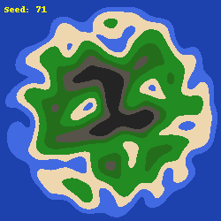

<h1 align="center">2D Map Generation</h1>

### Summary
I wanted to learn about how procedurally generated 2D tile maps worked, so I decided to build one in a simpler language first. This uses OpenSimplex (powers at be are unable to sue me), some basic concepts applied with Perlin Noise, and replacing "tiles" with pixels to create simple small images. Images are current at a resolution of **250x250**, as anything larger is annoying to compute in python with a reasonable number of iterations (I'm using 3 but it really should be in the realm of 6-10).

<h4 align="center">Example Image</h4>

	

### Note
I still have a lot of work to do on this, as this is only the beginning. Hopefully I can fix the island shape a bit more as at the moment, it looks rather like an angry masked man…
