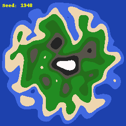

<h1 align="center">2D Map Generation</h1>

## Overworld
### Note
As a basis for learning about procedural generation for two dimensional maps, I decided to build one from scratch using Python, Pillow, and OpenSimplex. Each "tile" is represented by a single pixel allowing visualisations of these generated islands. Images work best at a lower resolution as Python struggles to build larger images at a reasonable speed. Depending on the power of your computer I would recommend adjusting the build iterations to not wait around forever. 
*(3-5: Slower, 6-15: Faster, Beyond: Beefy )*

<h4 align="center">Example Islands</h4>
<p align="center">
	
	
</p>

### Usage

```Python
island = IslandGen(width, height, seed_value, image_name)
```
<table>
	<tbody>
		<tr>
			<strong>
			<td>&nbsp;Class Arg</td>
			<td>&nbsp;Width &amp; Height</td>
			<td>Seed Value</td>
			<td>Image Name</td>
			</strong>
		</tr>
		<tr>
			<td>&nbsp;Explanation</td>
			<td>&nbsp;Dimensions of your image</td>
			<td>&nbsp;Number used to initialize the noise generator</td>
			<td>&nbsp;The file name returned by the software + ".png"</td>
		</tr>
	</tbody>
</table>

```Python
island.generate(iterations, scale, persistence, seed_label)
```
<table>
	<tbody>
		<tr>
			<strong>
			<td>&nbsp;Argument</td>
			<td>&nbsp;Iterations</td>
			<td>Scale</td>
			<td>Persistence</td>
			<td>Seed Label</td>
			</strong>
		</tr>
		<tr>
			<td>&nbsp;Explanation</td>
			<td>&nbsp;The number of times the noise generated is smoothed out</td>
			<td>
			<p>&nbsp;The "zoom" of the image (0.5 is a good starting place)</p>
			</td>
			<td>Level of detail in the image&nbsp;</td>
			<td>Boolean value. True: Adds label | False: Doesn't</td>
		</tr>
	</tbody>
</table>

### To-do List
**Overworld**
- [ ] River Placement
- [ ] Trees + Foliage
- [ ] Houses
- [ ] Ruins
- [ ] Dungeon Entrances
